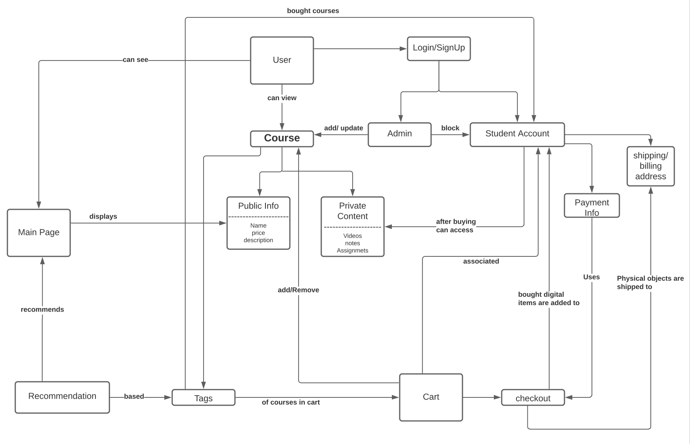
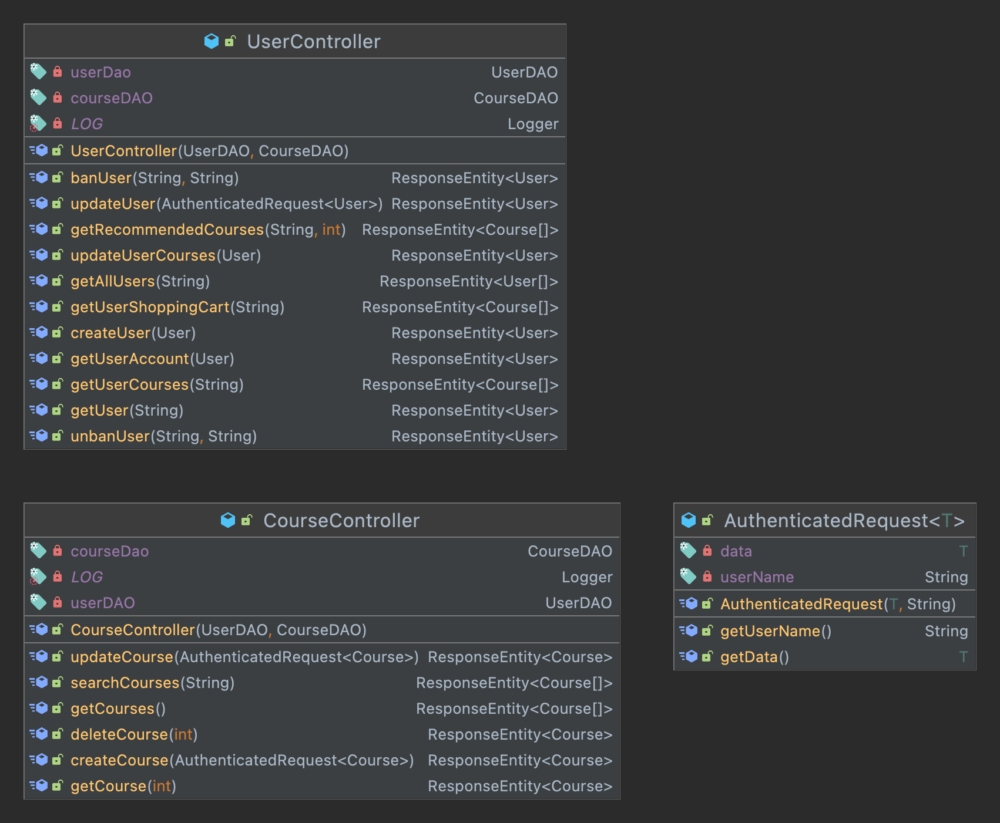
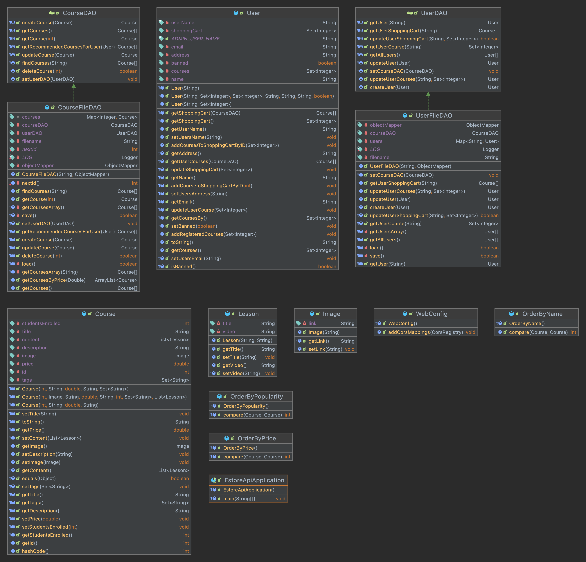

# PROJECT Design Documentation
<!-- > _The following template provides the headings for your Design
> Documentation.  As you edit each section make sure you remove these
> commentary 'blockquotes'; the lines that start with a > character
> and appear in the generated PDF in italics._ -->

## Team Information
* Team name: Name Undefined
* Team members:
  * Cole Johnson
  * Shandon Mith
  * Rhythm K C
  * Andrew Chang
  * Hunter Davonport

## Executive Summary

This project was a semester long assignment that involved a team of 5 students. The team collaborated in creating and implementing a website for the distribution of digital educational courses. Students can browse and purchase interesting courses, and Admins can modify and add courses.
The end result of the project is a fully functioning website.

### Purpose

In our case, our website revolves an interactive system where courses can be bought and accessed after purchasing. 
The most important user groups are the students.
The goals of these users are to purchase and be able to access the content in the courses available in the website.
<!-- With the admin, it is able to manage the contents of the courses.
With the users, they are able to view and search courses available in the website.
With the students, they are able to do everything a user can along with purchasing, modifying what they purchase, and accessing courses. 
-->
<!-- > _Provide a very brief statement about the project and the most -->
<!-- > important user group and user goals._ -->

### Glossary and Acronyms
<!-- > _Provide a table of terms and acronyms._ -->

| Term | Definition |
|------|------------|
|  MVP | Minimum Viable Product = a list of stories/epics that are required to be implemented in the first release of product. |

## Requirements

This section describes the features of the application.
<!-- > _In this section you do not need to be exhaustive and list every
> story.  Focus on top-level features from the Vision document and
> maybe Epics and critical Stories._ -->

### Definition of MVP
<!-- > _Provide a simple description of the Minimum Viable Product._ -->
The Minimum Viable Product is a product where users are able to access and use a website where they are
able to buy courses where they can later access bought courses to view their content. 

### MVP Features
<!-- > _Provide a list of top-level Epics and/or Stories of the MVP._ -->
List of Epics:
1. Add Courses to Cart
      An epic where students are able to add courses to cart, so they can purchase later.
2. Add/Update courses
      An epic where the admin is able to add, update, and remove courses.
3. Log In
      An epic where a user logs in as admin or student
4. Course Access
      An epic where the three user groups each have their own purposes to access courses.
      For users, they can view course contents.
      For students, they can interact and view all of the contents of the courses they've purchased.
      For the admin, they can view and edit courses.
      Courses are filtered by tags when a user searches up by a tag name. 
5. Recommendation
      An epic where all user groups can see recommended courses on the main page.
      For users, they see the first five most enrolled courses in the main page.
      For students, they see the first five recommended courses based on the courses they have previously purchased.
6. UI
      An epic where all user groups are able to access the website with its user interface.
      There is a user database and users can search courses that have unique properties in each respective course. 
      There are also images and lessons as unique properties for a course. 
7. Student Account
      An epic where students can manage their own account.
      Students have their own user page.
      All usernames are sanitized.
8. Managing Users
      An epic where admin is able to ban users either temporarily or permanently from using the site.

### Roadmap of Enhancements
<!-- > _Provide a list of top-level features in the order you plan to consider them._ -->
  1. UI
  2. Log In
  3. Add/Update Courses
  4. Add Courses to Cart
  5. Course Access
  6. Recommendation
  7. Student Account
  8. Managing Users

## Application Domain

This section describes the application domain.

<!-- > _Provide a high-level overview of the domain for this application. You
> can discuss the more important domain entities and their relationship
> to each other._ -->
The main product in this website are the courses and in each course, they contain their own name, price, and description
as their public info while their own videos, notes, and assignments are the private content of the courses.
When a user enters the website, they first see the main page that contains courses. The user can view courses or login/sign up at this point.
When a user signs in, they either log in as an admin or log in/sign up as a student.
When an admin is logged in, they can add, update, or delete courses while also being able to ban students if needed. 
With students, they have their own information saved in their account, such as their payment info and shipping/billing address in their user page.  
When students are logged in, they can add courses to a cart and can later checkout to purchase courses they've added with their payment info.
Once the students have bought their courses, they can access the private content of the courses. 
Every course has their unique set of tags according to the content and based on what the user has viewed and/or added to their cart, the website
would recommend courses that would interest the user in the main page. 

## Architecture and Design

This section describes the application architecture.

### Summary

The following Tiers/Layers model shows a high-level view of the webapp's architecture.

The e-store web application, is built using the Model–View–ViewModel (MVVM) architecture pattern. 

The Model stores the application data objects including any functionality to provide persistance. 

The View is the client-side SPA built with Angular utilizing HTML, CSS and TypeScript. The ViewModel provides RESTful APIs to the client (View) as well as any logic required to manipulate the data objects from the Model.

Both the ViewModel and Model are built using Java and Spring Framework. Details of the components within these tiers are supplied below.

### Overview of User Interface

This section describes the web interface flow; this is how the user views and interacts
with the e-store application.

When a user first enters the website, they first enter the main page where they can see components they can interact with.
Each component have their own specific purpose and when a user interacts with it, the Controllers manage the specific inputs.
With the specific inputs inputted from the user, the Controllers would then determine how the inputs should be stored or managed.
<!-- > _Provide a summary of the application's user interface.  Describe, from
> the user's perspective, the flow of the pages in the web application._ -->

### View Tier
<!-- > _Provide a summary of the View Tier UI of your architecture.
> Describe the types of components in the tier and describe their
> responsibilities.  This should be a narrative description, i.e. it has
> a flow or "story line" that the reader can follow._ -->
In the View Tier UI of our architecture, it consists of the visuals the user is able to see when they first enter the website. 
In the main page, the website shows a list of courses that users can view. At the top right, users can choose to touch a button to login/sign up.
When a user has logged in as a student, they can add courses to the cart. 
When a student touches the cart, it leads to a page where it shows all the courses the student added. 

<!-- > _You must also provide sequence diagrams as is relevant to a particular aspects 
> of the design that you are describing.  For example, in e-store you might create a 
> sequence diagram of a customer searching for an item and adding to their cart. 
> Be sure to include an relevant HTTP reuqests from the client-side to the server-side 
> to help illustrate the end-to-end flow._ -->
.png)

### ViewModel Tier
<!-- > _Provide a summary of this tier of your architecture. This
> section will follow the same instructions that are given for the View
> Tier above._ -->
In the ViewModel Tier, we have the CourseController and the UserController.
With these controllers, it helps the model decide what to do based on the inputs the user has put.
For CourseController, it heps with features that consists of courses, such as editing and searching of courses.
For UserController, it helps with features that consists of the user, such as creating and updating information on users.
<!-- > _At appropriate places as part of this narrative provide one or more
> static models (UML class diagrams) with some details such as critical attributes and methods._ -->

<!-- > PLEASE WORK |||||||||||||||||||||||||||||||||||||||||||||||||||||||||||||||||||||||||||||||||||||||||||||||||||||||||||||||||||||||| -->

### Model Tier
<!-- > _Provide a summary of this tier of your architecture. This
> section will follow the same instructions that are given for the View
> Tier above._ -->
In the Model Tier, we have the model and persistence layer.
The model layer helps ensure that the classes and structures for the users and courses are correct.
The persistence layer checks if the things that are stored and loaded are done properly.
<!-- > _At appropriate places as part of this narrative provide one or more
> static models (UML class diagrams) with some details such as critical attributes and methods._ -->

<!-- > PLEASE WORK |||||||||||||||||||||||||||||||||||||||||||||||||||||||||||||||||||||||||||||||||||||||||||||||||||||||||||||||||||||||| -->

### Static Code Analysis/Design Improvements
<!-- > _Discuss design improvements that you would make if the project were
> to continue. These improvement should be based on your direct
> analysis of where there are problems in the code base which could be
> addressed with design changes, and describe those suggested design
> improvements._ -->
With the way things are going, one improvement in this website is always to better optimize the code to be more concise and efficient.
<!-- > _With the results from the Static Code Analysis exercise, 
> discuss the resulting issues/metrics measurements along with your analysis
> and recommendations for further improvements. Where relevant, include 
> screenshots from the tool and/or corresponding source code that was flagged._ -->

## Testing
<!-- > _This section will provide information about the testing performed
> and the results of the testing._ -->

### Acceptance Testing
<!-- > _Report on the number of user stories that have passed all their
> acceptance criteria tests, the number that have some acceptance
> criteria tests failing, and the number of user stories that
> have not had any testing yet. Highlight the issues found during
> acceptance testing and if there are any concerns._ -->
1. Sprint 1: All 7 stories have passed their acceptance criteria test. 
2. Sprint 2: All 8 stories have passed their acceptance criteria test. 
3. Sprint 3: All 10 stories have passed their acceptancce criteria test.
4. Sprint 4: No stories have been made for this sprint. 

### Unit Testing and Code Coverage
<!-- > _Discuss your unit testing strategy. Report on the code coverage
> achieved from unit testing of the code base. Discuss the team's
> coverage targets, why you selected those values, and how well your
> code coverage met your targets. If there are any anomalies, discuss
> those._ -->
Our unit testing strategy comprises of testing 3 layers. The 3 layers are the persistence, model, and controller layers.
Whenever we are unit testing, we always unit test one layer specifically that doesn't depend on another layer for testing.
As we test through the layers separately, we are able to determine which layers are passed successfully and which are not.

The code coverage achieved from unit testing of the code base is 93%.
The team's coverage targets is everything the team has coded for this project, more specifically by the layers: persistence, model, and controller.
For model, it's to ensure the classes and structures for users and courses are correct.
For persistence, we check if what we store and load is done properly.
For controller, we check if the way we access the data is done properly and we are able to prevent unauthorized access.
Currently, our code coverage only has 93% because 7% of the code are from the methods used for the recommendation system. 
<!-- > our code coverage meets all of our targets except the main function due to the nature of the function not being able to be unit tested properly. -->
<!-- > PLEASE WORK ||||||||||||||||||||||||||||||||||||||||||||||||||||||||||||||||||||||||||||||||||||||||||||||||||||||||||||||||||||||| -->